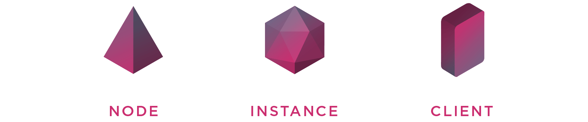
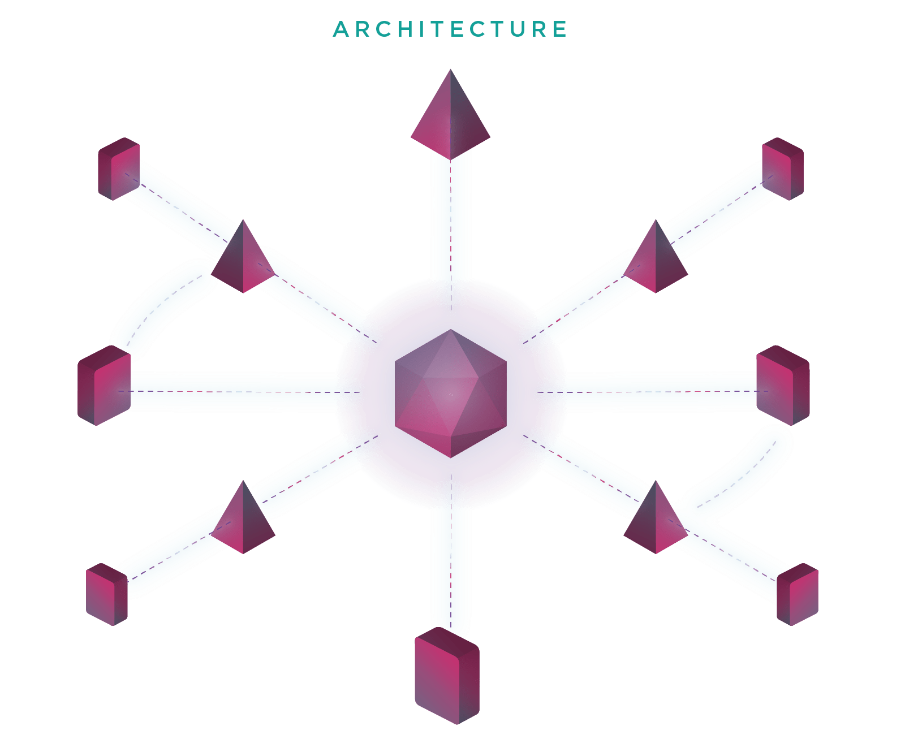
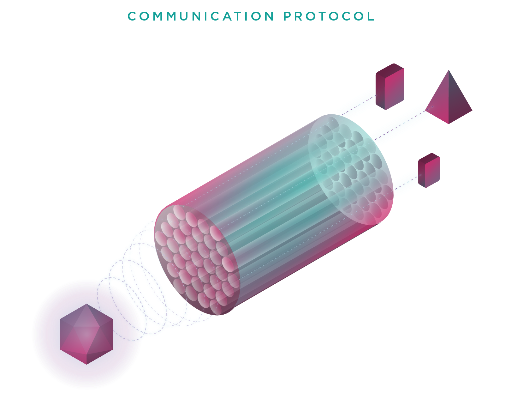

* [**FOUNDAMENTALS**](../index.md)
  1. [Introduction](../index.md)
  2. [**Architecture**](architecture.md)
  3. [How entities communicate](communication.md)
  4. [Entities decentralized information](decentralization.md)
  5. [Components](components.md)
* [SPECIFICATIONS](../specifications/client-management.md)
* [DEVELOPMENT](../development/get-started.md)

# Architecture

## Entities

### Nile has the following three entities:

- **Clients**: are the tool that you can use to browse a Nile. They can parse data into components and send / receive messages
- **Nodes (stores)**: are the endpoints. They define a set of properties (for example a product) that the clients are able to parse into components; they can also reply to requests. Nodes are like servers in a client/server architecture.
- **Instances**: one instance groups multiple nodes and clients and orchestrate them so they can communicate together. Nile is composed by multiple instances creating a federation.
Architecture
Each time a new node or a new client joins the network the information is propagated by the instance. When a client needs to communicate with a node, the communication occurs in a secure channel. This operation only works if the node is online; if not, the client can store the encrypted message on the instance, it will be delivered by the instance once the node gets online.

Nile can run even if instances are offline because the information about nodes and instances is stored on IPFS, the clients browse IPFS files in which are contained links to other IPFS files in which are contained more specific information about every entity.

Communication
The communication between nodes, clients and instances is protocol agnostic, it means that in the same network a node can listen requests using a HTTP server and another one using WebSockets. We created a library that handles this for you; so, in order to send a message to a node on HTTP or a node on WebSockets, you use the same API. The communication protocol is inspired by PubSub, entities can subscribe and publish messages to channels.

In the following image you can see an instance publishing a message to a generic channel, from the instance point of view, it is as simple as toAllEntities(“hello!”) but under the hood the message is being listened by entities from different protocols, you can visualize each protocol as every single pipe inside the big pipe that groups them all.

Next
If you want to learn more about how entities communicate, [go to the next section!](communication.md)

Please .
