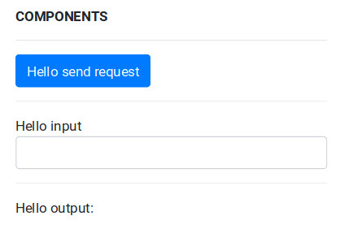

* [**FOUNDAMENTALS**](../index.md)
  1. [Introduction](../index.md)
  2. [Architecture](architecture.md)
  3. [How entities communicate](communication.md)
  4. [Entities decentralized information](decentralization.md)
  5. [**Components**](components.md)
* [SPECIFICATIONS](../specifications/client-management.md)
* [DEVELOPMENT](../development/get-started.md)

# Components

## What is a component
As we explained in the previous section, components are defined in a json file and then published by nodes in the decentralized storage.

In order to declar a component you need to define the following standard properties:
* **type**: the type of the component
* **name**: the human readable name of the component
* **key**: the unique identifier of the component (between the components of the same node)
* **data**: the initial state of the component

For each type of components, a component can have additional properties.

The type of the component is used to parse its data by the client into a specific UI.

# State of component
The state of the component can be change by both the node and the client.

## Client
The client parse the json file into a list of graphical component, these graphical components are binding to the data object of the component. Each time the user graphically interact with the component, the state is automatically updated (just on the client). The client can use a "request" component to send the whole state or specific state's variables to the node.

## Node
The node can reply with a specific message to change the state of the component. The message has the following properties:
* **channel**: `node.to.client`
* **recipient**: the recipient of the message
* **action**: setState
* **properties**:
  * **key**: the unique identifier of the component
  * **data**: the new state of the component

# An example
In order to better explain how components work, read the following example:

A node publishes the following components
```json
{
  "type": "input",
  "name": "Hello input",
  "key": "input_hello",
  "data": ""
},
{
  "type": "output",
  "name": "Hello output",
  "key": "output_hello",
  "data": ""
},
{
  "type": "submit",
  "name": "Hello send request",
  "key": "submit_hello",
  "parameters": ["input_hello"],
  "action": "function_hello"
}
```

When the client parse this components into UI it will be presented something like this:



When the "input_hello" is filled with text its state updates.

The "submit_hello" component is type "submit", the "submit" type has the property "parameters". It's an array that contains the keys of the componenets used as parameters in the request.

The "submit" component has also an "action" property. The action propety is used as action of the message for the node.

So, on the click of the submit button, a message is sent to the node containing:
* **recipient**: the node resource
* **channel**: `client.to.node`
* **action**: "function_hello",
* **parameters**:
  * **input_hello**: "new state of input_hello"

The node receives the message above and process it because it bound a function to channel "client.to.node" and action "function_hello". Inside the binded function the node can reply changing the state of the component on the client sending this message:
* **recipient**: the client resource
* **channel**: `node.to.client`
* **action**: "setState"
* **parameters**:
  * **key**: "output_hello"
  * **data**: "Message received"

The client will then update the "output_hello" with the new state "Message received"

# Next
Now you are ready to setup your environment, check [how to get started](../development/get-started.md)!

Or read the specification [here](../specifications/client-management.md).

Please .
